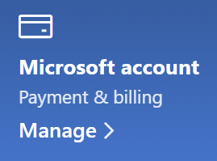

# Změna informací o účtu MicrosoftChange my Microsoft account information

Přejděte na [https://account.microsoft.com](https://account.microsoft.com/) a v případě potřeby se přihlaste.Go to [https://account.microsoft.com](https://account.microsoft.com/) and sign in if necessary. Tímto přejdete na řídicí panel účtu.This will take you to your account dashboard.  

**Upravit jméno a osobní údaje****Edit my name and personal information**

1. Na řídicím panelu účtu klikněte vedle obrázku a názvu účtu na **Další akce > upravit profil**.On your account dashboard, next to your account picture and name, click **More actions > Edit profile**.
2. Na stránce **Upravit profil** můžete pomocí zadaných odkazů změnit profilový obrázek, název, datum narození, umístění a jazyk zobrazení.On the **Edit profile** page, use the links provided to change your profile picture, name, date of birth, location, and display language preference. Podívejte se na odkazy na svoje profily účtu Xbox nebo Skype, kde můžete změnit podrobnosti pro tyto účty.Note the links to your Xbox or Skype account profiles, where you can change details specific to these accounts.

**Správa e-mailových adres a telefonních čísel****Manage e-mail addresses and phone numbers**

K účtu Microsoft je přidružena jedna nebo více e-mailových adres nebo telefonních čísel jako aliasy.A Microsoft account has one or more e-mail addresses or phone numbers associated with it as “aliases.” Při správě těchto:To manage these:

1. Na řídicím panelu účtu klikněte vedle obrázku a názvu účtu na **Další akce > upravit profil**.On your account dashboard, next to your account picture and name, click **More actions > Edit profile**.
2. Na stránce **Upravit profil** klikněte na **spravovat způsob přihlášení k Microsoftu**.On the **Edit profile** page, click **Manage how you sign in to Microsoft**. 
3. Zobrazí se seznam aliasů účtu a seznam můžete spravovat, včetně přidávání a odstraňování e-mailových adres a telefonních čísel.You will see a list of account aliases, and you can manage the list, including adding and deleting e-mail addresses and phone numbers. Zde můžete také vybrat aliasy, které se dají použít pro přihlášení k účtu a který alias je považován za "primární", který se zobrazí na vašich zařízeních s Windows 10.Here you can also select which aliases can be used to sign in to the account, and which alias is considered “primary,” which will be displayed on your Windows 10 devices.

**Správa způsobů platby a jména a adresy pro fakturaci****Manage payment methods, as well as name and address for billing** 

1. Na řídicím panelu účtu klikněte vedle obrázku a názvu účtu na **Další akce > upravit profil**.On your account dashboard, next to your account picture and name, click **More actions > Edit profile**.
2. V části **platební &** klikněte na **Spravovat**.Under **Payment & billing** click **Manage**.

    

3. Zde můžete přidat, upravit a odebrat způsoby platby a jejich přidružené fakturační adresy.Here you can add, edit, and remove payment methods and their associated billing addresses. 
