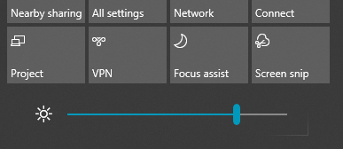

# Změna jasu obrazovky ve Windows 10Change screen brightness in Windows 10

Pokud je váš Windows 10 novější než verze 1903, má **Posuvník jasu** v centru akcí.If your Windows 10 is newer than version 1903, it has a **Brightness slider** in the action center. Pokud chcete otevřít Centrum akcí, klikněte na tlačítko **oznámení** na pravém okraji hlavního panelu nebo stiskněte **Windows Home + A** na klávesnici.To open the action center, click the **Notification** button at the rightmost side of your taskbar, or press **Windows home + A** on your keyboard.

Pokud používáte starší verzi Windows 10, můžete posuvník Jas najít tak, že přejdete na **[nastavení > systém > zobrazení](ms-settings:display?activationSource=GetHelp)**.If your Windows 10 is an earlier version, you can find the brightness slider by going to **[Settings > System > Display](ms-settings:display?activationSource=GetHelp)**.

**Poznámky**:**Notes**:

- Na stolních počítačích s externím monitorem se nezobrazuje jas změny pro vestavěný displej.You might not see the Change brightness for the built-in display slider on desktop PCs that have an external monitor. Pokud chcete změnit jas externího monitoru, použijte ovládací prvky na monitoru.To change the brightness of an external monitor, use the controls on the monitor.
- Pokud nemáte stolní počítač a jezdec se nezobrazí ani nefunguje, zkuste aktualizovat ovladač zobrazení.If you don't have a desktop PC and the slider doesn't appear or work, try updating the display driver. Do vyhledávacího pole na hlavním panelu zadejte **Správce zařízení**a potom v seznamu výsledků vyberte **Správce zařízení** .In the search box on the taskbar, type **Device Manager**, and then select **Device Manager** from the list of results. Ve **Správci zařízení**vyberte **grafické adaptéry**a pak vyberte grafický adaptér.In **Device Manager**, select **Display adapters**, then select the display adapter. Stiskněte a podržte (nebo klikněte pravým tlačítkem myši) na název grafického adaptéru a klikněte na **Aktualizovat ovladač**. pak postupujte podle pokynů.Press and hold (or right-click) the display adapter name and click **Update driver**; then follow the instructions.
