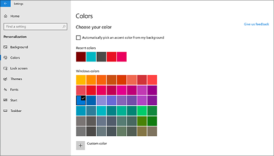
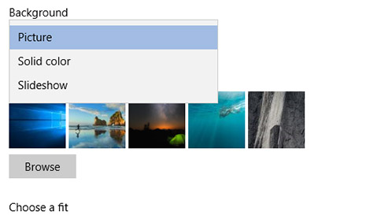

# Změna pozadí a barev plochy

Pokud chcete změnit nastavení barev, přejděte na **Start** Nastavení Přizpůsobení barvy a pak zvolte vlastní barvu nebo nechte Windows vytáhnout barvu motivu  >    >    >  z pozadí.

Pokud chcete změnit pozadí plochy, přejděte na **Úvodní** nastavení Přizpůsobení pozadí a pak zvolte obrázek, plnou barvu nebo vytvořte  >    >    >  prezentaci obrázků. 

Chcete další pozadí a barvy plochy? Navštivte [Microsoft Store](https://www.microsoft.com/store/collections/windowsthemes) a vyberte si z desítek bezplatných motivů.
