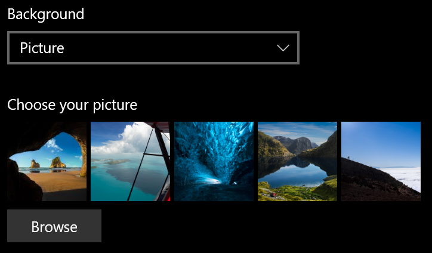
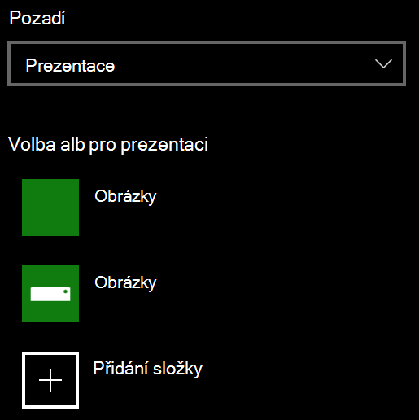

# Změna pozadí zamykací obrazovky

- Přejděte na **Obrazovku Settings**  >  Personalization Lock (Zamykací obrazovka  >  **Nastavení).** Nebo klikněte nebo klepněte [sem](ms-settings:lockscreen?activationSource=GetHelp).

- Pokud chcete nastavit vlastní obrázek na pozadí, vyberte **Obrázek** v **rozevíracím** seznamu Pozadí a zvolte nebo **Procházet** k obrázku.

  

- Pokud chcete nastavit prezentaci vlastních  obrázků,  vyberte v rozevíracím seznamu Pozadí možnost Prezentace a zvolte album nebo přidejte složku obsahující obrázky pro prezentaci.

  
