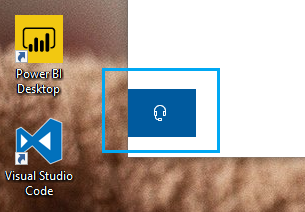

# Kontaktování kliknutím na tlačítko sluchátkaContact us by clicking the headphone button

Pokud chcete kontaktovat podporu Microsoftu, klikněte na **kontaktovat nás** v levém dolním rohu této aplikace.If you'd like to contact Microsoft Support, please click **Contact us** in the lower left corner of this app. V okně s rozbalením se zobrazí správný kanál podpory po zvolení kategorie produkt a problém.Inside the fly-out window, you will be guided to the right support channel after choosing your product and issue category.

V interakci s ostatními aplikacemi můžete i po zahájení relace s kontaktem kontaktovat.You can keep interacting with the rest of the app even after you have initiated a Contact us session. Panel kontakt je možné dočasně minimalizovat kliknutím kdekoli jinde uvnitř aplikace.The Contact us panel can be temporarily minimized by clicking anywhere else inside the app. Pokud se chcete vrátit ke stejné relaci, stačí kliknout na **kontakt** znovu.To return to the same session, just click **Contact us** again.
