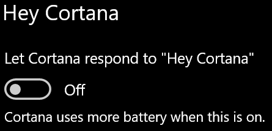

# Cortana se mnou nemluví nebo mě neslyšíCortana doesn’t talk to me or can’t hear me

Pokud se pokoušíte použít funkci Hey Cortana (Ahoj Cortano), která umožňuje mluvit s Cortanou bez výběru tlačítka Cortany na hlavním panelu nebo tlačítka mikrofonu na panelu Cortany, zkontrolujte, jestli je tato funkce povolená:If you are trying to use the "Hey Cortana" feature, which allows you to talk to Cortana without selecting the Cortana button on the taskbar or the microphone button in the Cortana panel, confirm that the feature is enabled:

1. Přejděte na **Start** a pak vyberte **[Nastavení > Cortana](ms-settings:cortana?activationSource=GetHelp)**.Go to **Start**, then select **[Settings > Cortana](ms-settings:cortana?activationSource=GetHelp)**.
2. V části Hey Cortana (Ahoj **Cortano)** přepněte přepínač Nechat Cortanu reagovat na přepínač Hey Cortana (Ahoj **Cortano)** na On **(Ahoj Cortano).**Under **Hey Cortana**, switch the **Let Cortana respond to "Hey Cortana"** toggle to **On**.

**Brání vaše nastavení ochrany osobních údajů Cortaně, aby vás poslechla?****Are your privacy settings preventing Cortana from hearing you?**

Vaše nastavení ochrany osobních údajů může Cortaně zabránit v odpovídání na váš hlas.Your privacy settings can prevent Cortana from responding to your voice.
- Zkontrolujte, jestli je zapnuté online rozpoznávání řeči:Check to make sure Online Speech recognition is turned on:
    - Přejděte na **Start a** potom klikněte na Nastavení > ochrana **[> řeči.](ms-settings:privacy-speech?activationSource=GetHelp)**Go to **Start**, then click **[Settings > Privacy > Speech](ms-settings:privacy-speech?activationSource=GetHelp)**.
    - V **části Online rozpoznávání řeči** přepněte nastavení na **Zapnout**.Under **Online speech recognition**, switch the setting to **On**.
- Zkontrolujte, jestli má Cortana oprávnění k přístupu k vašemu mikrofonu.Check to make sure Cortana has permission to access your microphone. 
    - Přejděte na Start a potom klikněte na **[Nastavení > ochrana osobních > Mikrofon](ms-settings:privacy-microphone?activationSource=GetHelp)**.Go to Start, then click **[Settings > Privacy > Microphone](ms-settings:privacy-microphone?activationSource=GetHelp)**.
    - V **části Zvolte, které** aplikace mají přístup k vašemu mikrofonu, vyhledejte **Cortanu** v seznamu aplikací a služeb a zkontrolujte, jestli je přepínač přepínejte na **Zapnout**.Under **Choose which apps can access your microphone**, look for **Cortana** within the list of apps and services and make sure the switch is toggled to **On**.

Kromě toho se také ujistěte, že jsou reproduktory nebo mikrofony vzhůru a pracují, aby si mohli promluvit s Cortanou.Moreover, please also make sure that your speakers or microphones are up and working in order to talk to Cortana.
