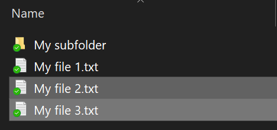
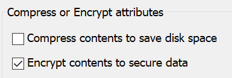

# Šifrování souborů nebo složek ve Windows 10Encrypt files or folder in Windows 10

Pomocí nástroje BitLocker můžete zašifrovat celý disk. Pokud chcete zašifrovat jenom jednotlivé soubory nebo složky (a jejich obsah), postupujte následovně:You can encrypt an entire disk using BitLocker, but to encrypt only individual files or folders (and their contents):

1. V **Průzkumníku souborů** vyberte soubory nebo složky, které chcete šifrovat.In **File Explorer**, select the file(s)/folder(s) you want to encrypt. V tomto příkladě jsou vybrané dva soubory:In this example, two files have been selected:

    

2. Klikněte pravým tlačítkem myši na vybrané soubory a potom klikněte na **Vlastnosti**.Right-click the selected files and click **Properties**.

3. V okně **Vlastnosti** klikněte na **Upřesnit…**In the **Properties** window, click **Advanced**.

4. V okně **Upřesnit atributy** zaškrtněte políčko **Šifrovat obsah a zabezpečit tak data**:In the **Advanced Properties** window, select the **Encrypt contents to secure data** checkbox:

    

5. Klikněte na **OK**.Click **OK**.
