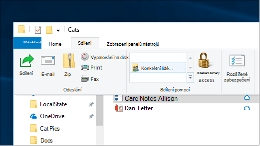
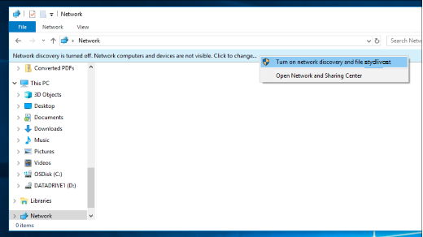

# Sdílení souborů přes síť v Windows 10

**Poznámka:** Pokud jste dříve pro sdílení souborů používali domácí skupinu, upozorňujeme, že domácí skupina byla z Windows 10 (verze 1803) odebrána. Teď můžete sdílet tiskárny a soubory pomocí předdefinované funkce v Windows 10.

**Sdílení souborů nebo složek v síti**

- V **Průzkumníkovi** souborů vyberte soubor, >  klikněte na kartu Sdílet v horní > části Sdílet **s** a klikněte na **Konkrétní lidé**.

    
          
- Pokud vyberete více souborů najednou, můžete je všechny sdílet stejným způsobem. Funguje i pro složky.

**Zobrazení zařízení v síti, která sdílejí soubory**

- V **Průzkumníkovi souborů** přejděte na **Síť**. Pokud zjišťování sítě není povolené, zobrazí se chybová zpráva "Zjišťování sítě je vypnuté..."

- Klikněte na **banner Zjišťování sítě je vypnuté** a potom klikněte na Zapnout zjišťování sítě a sdílení **souborů.**

    

[Další informace o sdílení souborů v síti](https://support.microsoft.com/help/4092694/windows-10-file-sharing-over-a-network)

[Sdílení souborů pomocí aplikací, OneDrive, e-mailů a dalších](https://support.microsoft.com/help/4027674/windows-10-share-files-in-file-explorer)
