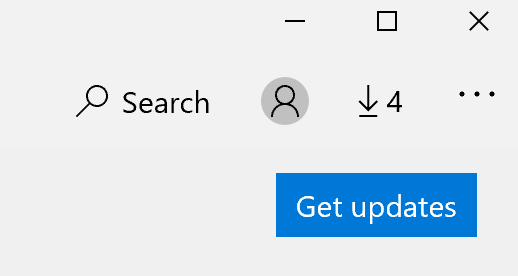

# Oprava jazyku zobrazení aplikací

Po změně jazyka zobrazení ve Windows 10 mohou některé aplikace použít předchozí jazyk, když je otevřete. K tomu dochází, protože nové verze aplikací pro tento jazyk musí být staženy ze Storu. Tento problém můžete vyřešit tak, že buď počkáte na automatickou aktualizaci, nebo aktualizujete aktualizované verze aplikací.

Pokud chcete aktualizaci nainstalovat ručně, otevřete **Microsoft Store** a v pravém horním rohu klikněte na **stahování a aktualizace** . Pak klikněte na **načíst aktualizace**. Pokud se jazyk po dokončení aktualizace nezměnil, zkuste restartovat počítač.

Další informace o nastaveních jazyka pro vstup a zobrazení najdete [v článku Správa nastavení jazyka pro vstup a zobrazení ve Windows 10](https://support.microsoft.com/help/4027670/windows-10-add-and-switch-input-and-display-language-preferences).
