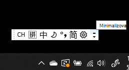
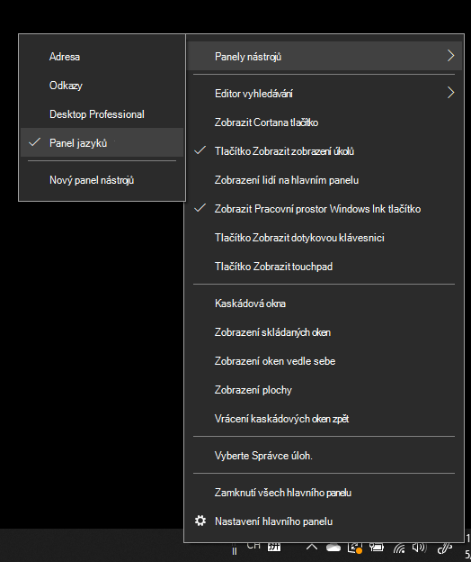
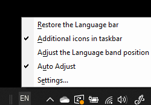

# Skrytí, zobrazení nebo obnovení panelu jazyků

**Chcete-li minimalizovat panel jazyků:**

Můžete kliknout na tlačítko minimalizovat v pravém horním rohu panelu jazyků. Nebo stačí přetáhnout panel jazyků na hlavní panel, který jej automaticky minimalizuje.

**Vysunout panel jazyků:**

Pokud nechcete ukotvit panel jazyků na hlavním panelu, klepněte pravým tlačítkem myši na libovolné prázdné místo na hlavním panelu a zškrtněte zaškrtnutí **políčka Panel jazyků** v nabídce Panely nástrojů. Tím se panel jazyků zobrazí mimo hlavní panel, stejně jako předchozí snímek obrazovky.

**Obnovení výchozího nastavení panelu jazyků:**

Klepněte pravým tlačítkem myši na tlačítko jazyka na panelu nástrojů a v nabídce klepněte na **tlačítko Obnovit panel jazyků.** Tím se obnoví výchozí nastavení.

