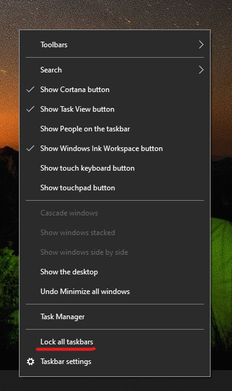

# Přesunutí hlavního panelu na obě strany nebo na horní část plochyMove the taskbar to either side or the top of your desktop

Nejprve potvrďte, že je hlavní panel odemčený.First, please confirm that the taskbar is unlocked. Chcete-li zjistit, zda je vaše odemčená, klikněte pravým tlačítkem myši na libovolné prázdné místo na hlavním panelu a zjistěte, zda je na **hlavním panelu** zaškrtnuták.To find out whether yours is unlocked, right-click any empty space on the taskbar and see whether **Lock the taskbar** has a checkmark next to it. Pokud je zaškrtnuté políčko, hlavní panel je uzamčen a nelze jej přesunout.If there is a checkmark, the taskbar is locked and cannot be moved. Když jednou **kliknete na Zamknout hlavní panel,** odemkne se a zaškrtnete.Clicking **Lock the taskbar** once will unlock it and remove the checkmark.

Pokud máte více monitorů, které zobrazují hlavní panel, zobrazí **se funkce Zamknout všechny hlavní panely**.If you have multiple monitors that display the taskbar, you will see **Lock all taskbars**.

Po odemknutí hlavního panelu můžete stisknout a podržet prázdné místo na hlavním panelu a přetáhnout ho na požadované místo na obrazovce.Once the taskbar is unlocked, you can press and hold any empty space on the taskbar and drag it to the location you want on the screen. Můžete tak učinit také kliknutím pravým tlačítkem myši na libovolné prázdné místo na hlavním panelu a přejděte na \*\* [nastavení hlavního panelu](ms-settings:taskbar?activationSource=GetHelp) > umístění hlavního panelu na obrazovce\*\*.You can also do so by right-clicking on any empty space on the taskbar and go to **[Taskbar settings](ms-settings:taskbar?activationSource=GetHelp) > Taskbar location on screen**.
