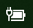

# Ikona napájení nebo baterie chybí ve Windows 10

Pokud má zařízení s Windows 10 ikonu baterie (např. přenosný počítač, tablet nebo počítač připojený přes USB k UPS), obvykle se na hlavním panelu poblíž hodin zobrazí ikona napájení/baterie, například:

Pokud tuto ikonu nevidíte, může být skrytá:

1. Přejděte na **[Nastavení > Přizpůsobení > Hlavní panel](ms-settings:taskbar?activationSource=GetHelp)**.

2. V oznamovací oblasti klikněte na **Vyberte, které ikony se zobrazí na hlavním panelu**.

3. Potom najděte položku **Napájení (Power)** v seznamu a přepněte nastavení na **Zapnuté**.

    

**Řešení potíží**

Pokud jste postupovali podle výše uvedených pokynů a přepínač **Napájení (Power)** je zobrazený šedě nebo není viditelný, zadejte do vyhledávacího pole na hlavním panelu **správce zařízení** a potom v seznamu výsledků vyberte **Správce zařízení**. V části **Baterie** klikněte pravým tlačítkem myši na ikonu baterie vašeho zařízení, klikněte na možnost **Vypnout** a potom na **Ano**. Počkejte několik sekund a potom klikněte pravým tlačítkem myši na ikonu baterie a na **Zapnout**. Pak restartujte zařízení.

Pokud jste postupovali podle výše uvedených pokynů, ale ikona baterie se nezobrazuje na hlavním panelu, zadejte do vyhledávacího pole na hlavním panelu **správce úloh** a potom v seznamu výsledků klikněte na **Správce úloh**. Na kartě **Procesy** klikněte v části **Název** pravým tlačítkem na **Explorer** a potom klikněte na **Restartovat**.
