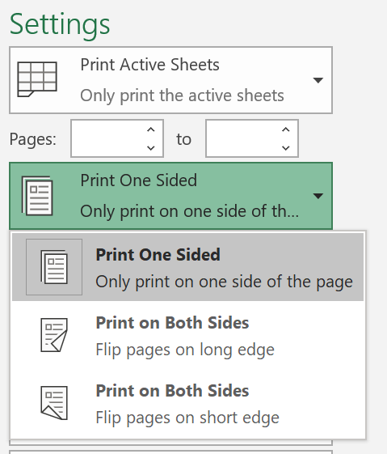
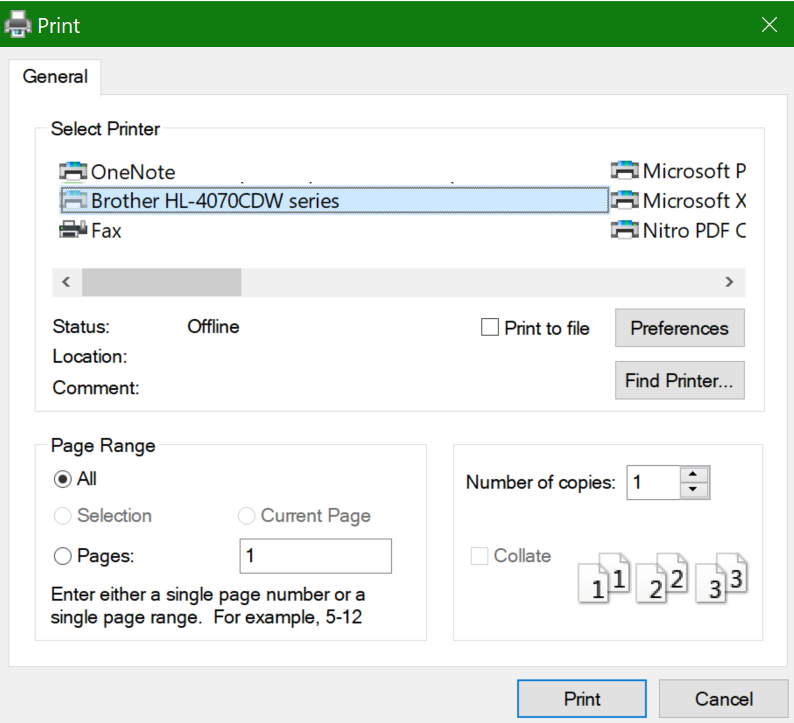

# Tisk na obě strany papíru (oboustranný tisk)

**Je tiskárna schopná oboustranného tisku?**

Shrnutí nebo příručka funkcí tiskárny by vám měly říct, jestli je schopná tisknout na obě strany papíru, označované také jako "oboustranný tisk". Pokud máte Microsoft Office, můžete to zjistit také tak, že otevřete aplikaci Office, jako je Word nebo Excel, otevřete Soubor **>** Tisk , zkontrolujte, jestli je vybraná ta pravá tiskárna, a vyhledejte možnosti v části Nastavení. Příklad: 

**Oboustranný tisk v Microsoft Office**

Pokud je vaše tiskárna schopná tisknout na obou stranách, když v aplikaci Office přejděte na Soubor **>** Tisk, zobrazí se možnost Vytisknout na obou stranách, jak ukazuje výše uvedený příklad.  Vyberte typ oboustranného tisku, který chcete použít (překlopit na  delší okraj nebo překlopit na krátký okraj) a kliknutím na Tisk spusťte výtisk.

**Oboustranný tisk z libovolné aplikace**

V mnoha aplikacích při tisku se zobrazí obecné dialogové okno tisku, které vypadá takhle: 

Ujistěte se, že je vybraná ta pravá tiskárna, a potom kliknutím **na Předvolby** otevřete okno předvoleb tiskárny. Pokud je tiskárna schopná oboustranného tisku, zobrazí se v tomto okně možnost povolit tuto možnost pro aktuální tiskovou úlohu.
