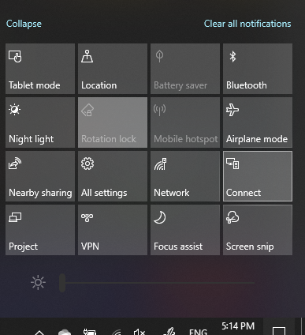

# Projekt na počítač

Na cílovém zařízení (promítáte do) vyhledejte "Nastavení projekce" a otevřete stránku Nastavení **promítání do tohoto počítače**. Pak se ujistěte, že:
- "Některá zařízení se systémem Windows a Android mohou promítat do tohoto počítače, když říkáte, že je to v pořádku" rozevírací nabídka je nastavena na **Vždy vypnuto**.
- Rozevírací nabídka "Ask to project to this PC" je nastavena na **Pokaždé, když je vyžadováno připojení**.
- Rozevírací nabídka "Vyžadovat PIN pro párování" je nastavena na **Možnost Nikdy**.

Na cílovém zařízení spusťte aplikaci **Connect** tak, že přejdete na **úvodní obrazovku** a vyhledejte "Připojit".

Potom na zdrojovém zařízení, ze kterého se pokoušíte promítnout:

1. Stisknutím **klávesy Windows + A** otevřete Centrum akcí.
2. Klepněte na tlačítko **Připojit**.
3. Klikněte na zařízení, na které chcete promítat obrazovku.

Po výše uvedených krocích by mělo cílové zařízení zobrazit obrazovku zdrojového zařízení, jako by se jednalo o sekundární monitor.
