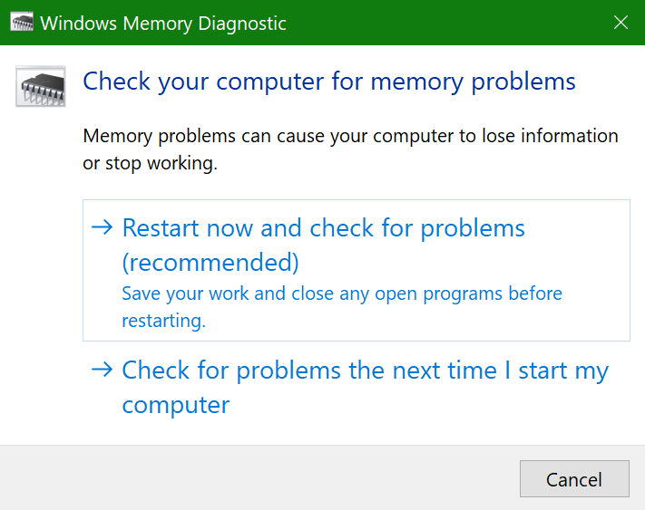
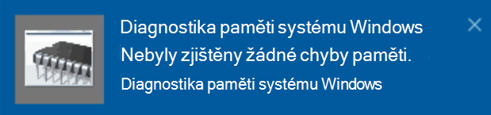

# Spuštění diagnostiky paměti Windows ve Windows 10

Pokud systém Windows a aplikace na vašem počítači způsobí zhroucení, mrznutí nebo nestabilní způsob, může dojít k potížím s pamětí počítače (RAM). Nástroj Diagnostika paměti Windows můžete použít ke kontrole problémů s pamětí RAM počítače.

Do vyhledávacího pole na hlavním panelu zadejte **Diagnostika paměti**a pak vyberte **Nástroj Diagnostika paměti Windows**. 

Pokud chcete diagnostiku spustit, musí se počítač restartovat. Máte možnost okamžitě restartovat (uložte svoji práci a zavřete otevřené dokumenty a e-maily), nebo naplánujte automatické spuštění diagnostiky při příštím restartování počítače:

Po restartování počítače se automaticky spustí **Nástroj Diagnostika paměti Windows** . Stav a průběh se zobrazí jako diagnostický nástroj a máte možnost, abyste diagnostiku zrušili stisknutím klávesy **ESC** na klávesnici.

Po dokončení diagnostiky se systém Windows spustí normálně.
Hned po restartování po zobrazení plochy se zobrazí oznámení (vedle ikony **Centrum akcí** na hlavním panelu), které označuje, jestli byly nalezeny nějaké chyby paměti. Příklad:

Tady je ikona centra akcí:  

A ukázkové oznámení: 

Pokud jste oznámení zmeškali, můžete vybrat ikonu **centra akcí** na hlavním panelu a zobrazit **Centrum akcí** a zobrazit posuvný seznam oznámení.

Podrobné informace zobrazíte tak, že do vyhledávacího pole na hlavním panelu zadáte **událost** a pak vyberete **Prohlížeč událostí**. V levém podokně **prohlížeče událostí**přejděte na **protokoly Windows > systém**. V pravém podokně prohledejte seznam ve **zdrojovém** sloupci, dokud neuvidíte události se zdrojovou hodnotou **MemoryDiagnostics-Results**. Zvýrazněte každou událost a podívejte se na informace o výsledku do pole pod kartou **Obecné** pod seznamem.
