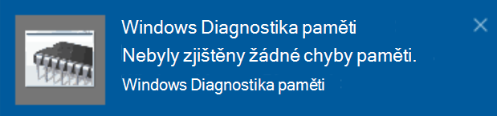

# Spuštění diagnostiky paměti Windows ve Windows 10Run Windows Memory Diagnostics in Windows 10

Pokud systém Windows a aplikace na vašem počítači způsobí zhroucení, mrznutí nebo nestabilní způsob, může dojít k potížím s pamětí počítače (RAM).If Windows and apps on your PC are crashing, freezing, or acting in an unstable manner, you may have a problem with the PC’s memory (RAM). Nástroj Diagnostika paměti Windows můžete použít ke kontrole problémů s pamětí RAM počítače.You can run the Windows Memory Diagnostic to check for problems with the PC’s RAM.

Do vyhledávacího pole na hlavním panelu zadejte **Diagnostika paměti**a pak vyberte **Nástroj Diagnostika paměti Windows**.In the search box on your taskbar, type **memory diagnostic**, and then select **Windows Memory Diagnostic**. 

Pokud chcete diagnostiku spustit, musí se počítač restartovat.To run the diagnostic, the PC needs to restart. Máte možnost okamžitě restartovat (uložte svoji práci a zavřete otevřené dokumenty a e-maily), nebo naplánujte automatické spuštění diagnostiky při příštím restartování počítače:You have the option to restart immediately (please save your work and close open documents and e-mails first), or schedule the diagnostic to run automatically the next time the PC restarts:

Po restartování počítače se automaticky spustí **Nástroj Diagnostika paměti Windows** .When the PC restarts, the **Windows Memory Diagnostics Tool** will run automatically. Stav a průběh se zobrazí jako diagnostický nástroj a máte možnost, abyste diagnostiku zrušili stisknutím klávesy **ESC** na klávesnici.Status and progress will be displayed as the diagnostics run, and you have the option of cancelling the diagnostics by hitting the **ESC** key on your keyboard.

Po dokončení diagnostiky se systém Windows spustí normálně.When the diagnostics are complete, Windows will start normally.
Hned po restartování po zobrazení plochy se zobrazí oznámení (vedle ikony **Centrum akcí** na hlavním panelu), které označuje, jestli byly nalezeny nějaké chyby paměti.Immediately after restart, when the Desktop appears, a notification will appear (next to the **Action Center** icon on the taskbar), to indicate whether any memory errors were found. Příklad:For example:

Tady je ikona centra akcí:Here's the Action Center icon:  

A ukázkové oznámení:And a sample notification: 

Pokud jste oznámení zmeškali, můžete vybrat ikonu **centra akcí** na hlavním panelu a zobrazit **Centrum akcí** a zobrazit posuvný seznam oznámení.If you missed the notification, you can select the **Action Center** icon  on the taskbar to display the **Action Center** and see a scrollable list of notifications.

Podrobné informace zobrazíte tak, že do vyhledávacího pole na hlavním panelu zadáte **událost** a pak vyberete **Prohlížeč událostí**.To review detailed information, type **event** into the search box on your taskbar, and then select **Event Viewer**. V levém podokně **prohlížeče událostí**přejděte na **protokoly Windows > systém**.In the **Event Viewer**’s left-hand pane, navigate to **Windows Logs > System**. V pravém podokně prohledejte seznam ve **zdrojovém** sloupci, dokud neuvidíte události se zdrojovou hodnotou **MemoryDiagnostics-Results**.In the right-hand pane, scan down the list while looking at the **Source** column, until you see events with Source value **MemoryDiagnostics-Results**. Zvýrazněte každou událost a podívejte se na informace o výsledku do pole pod kartou **Obecné** pod seznamem.Highlight each such event and see the result information in the box under the **General** tab below the list.
