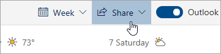

# Sdílení s Outlookem na webu

V kalendáři na panelu nástrojů v horní části stránky vyberte **Sdílet**a vyberte kalendář, který chcete sdílet.

    

**Poznámka:** Kalendáře vlastněné jinými uživateli nelze sdílet.

- Zadejte jméno nebo e-mailovou adresu osoby, se kterou chcete kalendář sdílet.
- Zvolte, jak má daná osoba používat váš kalendář:
    - **Zobrazení, když jsem zaneprázdněn**   umožňuje jim zobrazit, kdy jste zaneprázdněni, ale neobsahuje podrobnosti, jako je umístění události.
    - **Můžete zobrazit názvy a umístění**   umožňuje jim vidět, kdy jste zaneprázdněni, stejně jako název a umístění událostí.
    - **Může zobrazit všechny podrobnosti**   umožňuje jim zobrazit všechny podrobnosti o vašich událostech.
    - **Umí upravovat**   umožňuje upravit váš kalendář.
    - **Delegát**   umožňuje jim upravovat kalendář a sdílet jej s ostatními.
- Vyberte **Sdílet**.
