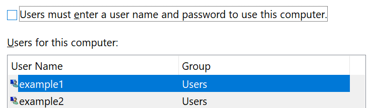

# Přihlášení do Windows 10 bez použití hesla

Chcete-li se vyhnout zadávání hesla při spuštění systému Windows, doporučujeme použít jednu z možností zabezpečeného přihlášení Windows Hello, jako je PIN, rozpoznávání obličeje nebo otisk prstu, pokud je dostupný. Pokud opravdu chcete zakázat zabezpečené přihlašování, přečtěte si následující pokyny v části Automatické přihlášení k Windows 10.

**Zabezpečení alternativních možností Windows Hello s heslem účtu**

Přejděte na **nastavení > účty > možnosti přihlášení** (nebo klikněte [sem](ms-settings:signinoptions?activationSource=GetHelp)). Budou dostupné možnosti přihlášení. Příklad:

Kliknutím nebo klepnutím na jednu z možností ji nakonfigurujte. Při příštím spuštění nebo odemčení Windows budete moct místo hesla použít novou možnost. 

**Automatické přihlášení do Windows 10**

**Poznámka**: automatické přihlašování je vhodné, ale představuje bezpečnostní riziko, obzvláště v případě, že je váš počítač přístupný více lidem. 

1. Klikněte nebo klepněte na tlačítko **Start** na hlavním panelu.

2. Zadejte **netplwiz** a stisknutím klávesy ENTER otevřete okno uživatelské účty.

3. V části **uživatelské účty**klikněte na účet, ke kterému se chcete automaticky přihlásit při spuštění systému Windows.

4. Zrušte zaškrtnutí políčka před použitím tohoto počítače musí uživatelé zadat uživatelské jméno a heslo.

    

5. Klikněte na tlačítko **OK**. Zobrazí se výzva k zadání a potvrzení hesla vybraného účtu. Kliknutím na **OK** dokončete. Po příštím spuštění Windows 10 se automaticky přihlásí k vybranému účtu.
