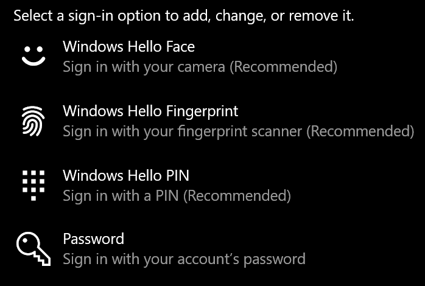
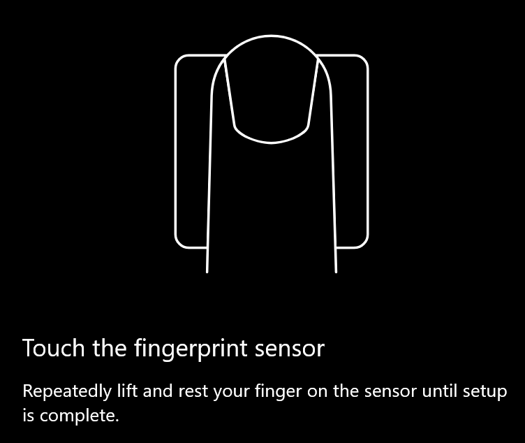
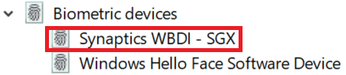

# Použití možnosti odemknutí otisku prstu ve Windows 10Use fingerprint unlock option in Windows 10

**Povolení otisku prstu ve Windows Hello****Enable Windows Hello Fingerprint**

Pokud chcete odemknout Windows 10 pomocí otisku prstu, musíte nastavit Windows Hello Fingerprint přidáním (aby se Systém Windows naučil rozpoznávat) aspoň jedním prstem.To unlock Windows 10 using your fingerprint, you need to set up Windows Hello Fingerprint by adding (letting Windows learn to recognize) at least one finger. 

1. Přejděte na **Nastavení > Účty > možnosti přihlášení** (nebo klikněte [sem).](ms-settings:signinoptions?activationSource=GetHelp)Go to **Settings  > Accounts > Sign-in options** (or click [here](ms-settings:signinoptions?activationSource=GetHelp)). Zobrazí se dostupné možnosti přihlášení.Available sign-in options will be listed. Příklad:For example:

    

2. Klikněte nebo klepněte na **Windows Hello Fingerprint** a potom na **Nastavit.**Click or tap **Windows Hello Fingerprint**, then click **Set up**. V okně nastavení Windows Hello klikněte na **Začínáme.**In the Windows Hello setup window, click **Get started**. Senzor otisku prstu se aktivuje a zobrazí se dotaz, jestli na senzor položíte prst:The fingerprint sensor will activate, and you'll be asked to place your finger on the sensor:

   

3. Postupujte podle pokynů, které vás budou žádat, abyste prst opakovaně naskenoval.Follow the instructions, which will ask you to repeatedly scan your finger. Po dokončení budete mít možnost přidat další prsty, které budete chtít použít pro přihlášení.When this is finished, you'll have the option of adding other fingers you may want to use for sign-in. Až se příště přihlásíte k Windows 10, budete k tomu mít možnost použít otisk prstu.Next time you sign in to Windows 10, you will have the option of using your fingerprint to do so.

**Otisk prstu Windows Hello není k dispozici jako možnost přihlášení****Windows Hello Fingerprint not available as a sign-in option**

Pokud se v možnostech přihlášení nezobrazí otisk prstu Windows Hello **,** znamená to, že Windows o žádné čtečce otisků prstů nebo skeneru připojeném k počítači ani o tom, že zásady systému brání jeho použití (pokud například váš počítač spravuje vaše pracoviště).If Windows Hello Fingerprint is not shown as an option in **Sign-in options**, it means Windows is not aware of any fingerprint reader/scanner attached to your PC, or that a system policy prevents its use (if for example your PC is managed by your workplace). Řešení potíží:To troubleshoot: 

1. Na hlavním panelu vyberte tlačítko **Start** a vyhledejte **Správce zařízení.**Select the **Start** button in the Taskbar and search for **Device Manager**.

2. Kliknutím nebo klepnutím otevřete **Správce zařízení**.Click or tap to open **Device Manager**.

3. Ve Správci zařízení rozbalte biometrická zařízení kliknutím na jeho chevron.In Device Manager, expand Biometric devices by clicking its chevron.

   

4. Skener otisků prstů by měl být uvedený jako biometrické zařízení, například skener Synaptics WBDI:Your fingerprint scanner should be listed as a biometric device, such as the Synaptics WBDI scanner:

   

5. Pokud se čtečka otisků prstů nezobrazí a skener je integrovaný do počítače, přejděte na web výrobce počítače.If your fingerprint scanner is not shown, and the scanner is integrated into your PC, go to the PC manufacturer's website. V části technické podpory vašeho modelu počítače vyhledejte ovladač Windows 10 pro skener, který můžete nainstalovat.In the technical support section for your PC model, search for a Windows 10 driver for a scanner that you can install.

6. Pokud je skener oddělený od počítače (připojeného přes USB), přejděte na web výrobce skeneru a vyhledejte a nainstalujte software ovladače zařízení s Windows 10 pro model skeneru, který máte.If the scanner is separate from the PC (attached via USB), go to the scanner manufacturer's website to find and install Windows 10 device driver software for the scanner model you have.
