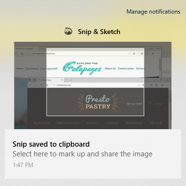

# Pomocí výstřižku & náčrtu můžete digitalizovat, označovat a sdílet obrázky.Use Snip & Sketch to capture, mark up, and share images

Skica obrazovky se teď nazývá **& náčrtek**.Screen sketch is now called **Snip & Sketch**. **Rychlý střih výstřižku**:**To quickly take a snip**:

1. Stiskněte klávesu s **logem Windows + SHIFT + S**. Zobrazí se obrazovka s ztmavením a kurzorem zobrazeným jako křížek.Press the **Windows logo key + Shift + S**. You'll see your screen darken and your cursor displayed as a cross. 

2. Zvolte bod na okraji oblasti, kterou chcete zkopírovat, a klikněte na něj pravým tlačítkem myši.Choose a point at the edge of the area you want to copy and left-click the cursor. 

3. Přesunutím kurzoru zvýrazněte oblast, kterou chcete digitalizovat.Move your cursor to highlight the area you want to capture. Oblast, kterou zachytíte, se zobrazí na obrazovce.The area you capture will appear on your screen.

   

Obrázek, který jste vyjímá, se uloží do schránky, připravený pro vložení do e-mailu nebo dokumentu.The image you snipped is saved to your clipboard, ready for pasting into an email or document. 

**Pokud chcete obrázek upravit nebo zobrazit**:**If you want to edit or view the image**: 

- Klikněte na ikonu oznámení na pravém okraji hlavního panelu. potom klikněte na obrázek, který jste právě nachytili.Click the notifications icon at the far right side of the taskbar; then click the picture you have just captured. Výstřižek se otevře v aplikaci výstřižek &.Your snip opens in the Snip & Sketch app.

   
