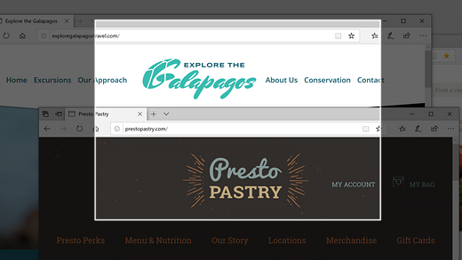

# Použití funkce & Skica k zachycení, označení a sdílení obrázků

Skica na obrazovce se teď nazývá **& Skica**. **Rychlé odsání:**

1. Stiskněte klávesu **Windows + Shift + S**. Obrazovka se ztmaří a kurzor se zobrazí jako křížek. 

2. Vyberte bod na okraji oblasti, kterou chcete zkopírovat, a klikněte na kurzor doleva. 

3. Přesunutím kurzoru zvýrazněte oblast, kterou chcete zachytit. Na obrazovce se zobrazí oblast, kterou zachytíte.

   

Obrázek, který jste vyřízli, se uloží do schránky a je připravený k vložení do e-mailu nebo dokumentu. 

**Pokud chcete obrázek upravit nebo zobrazit:** 

- Klikněte na ikonu oznámení na pravé straně hlavního panelu. a potom klikněte na obrázek, který jste právě zachytili. Váš odsátek se otevře v aplikaci & Skica.

   
