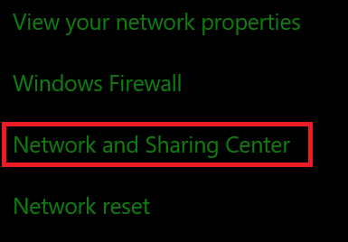
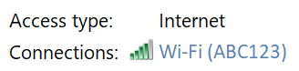
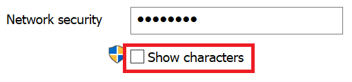

# Zobrazení síťového hesla Wi-Fi ve Windows 10View Wi-Fi network password in Windows 10

1. Zkontrolujte, jestli máte počítač s Windows 10 připojený k síti Wi-Fi.Make sure your Windows 10 PC is connected to the Wi-Fi network.

2. Přejděte na **nastavení > síti & > Internetu**nebo klikněte nebo klepněte [sem](ms-settings:network?activationSource=GetHelp) a nechte nás tam.)Go to **Settings  > Network & Internet  > Status**, or click or tap [here](ms-settings:network?activationSource=GetHelp) to let us take you there now.)

3. Klikněte na **Centrum síťových sítí a sdílení**.Click **Network and Sharing Center**.

    

4. V **centru sítí a sdílení**uvidíte vedle možnosti **připojení**název vaší bezdrátové sítě.In **Network and Sharing Center**, next to **Connections**, you will see the name of your wireless network. Pokud má vaše síť například název "ABC123", může se zobrazit:For example, if your network is named "ABC123," you might see:

    

    Kliknutím na název bezdrátové sítě otevřete okno stav Wi-Fi.Click the wireless network name to open the Wi-Fi Status window. 

5. V okně stav Wi-Fi klikněte na **Vlastnosti bezdrátového připojení**, klikněte na kartu **zabezpečení** a zaškrtněte **Zobrazit znaky**.In the Wi-Fi Status window, click **Wireless Properties**, click the **Security** tab, and check **Show characters**.

    

